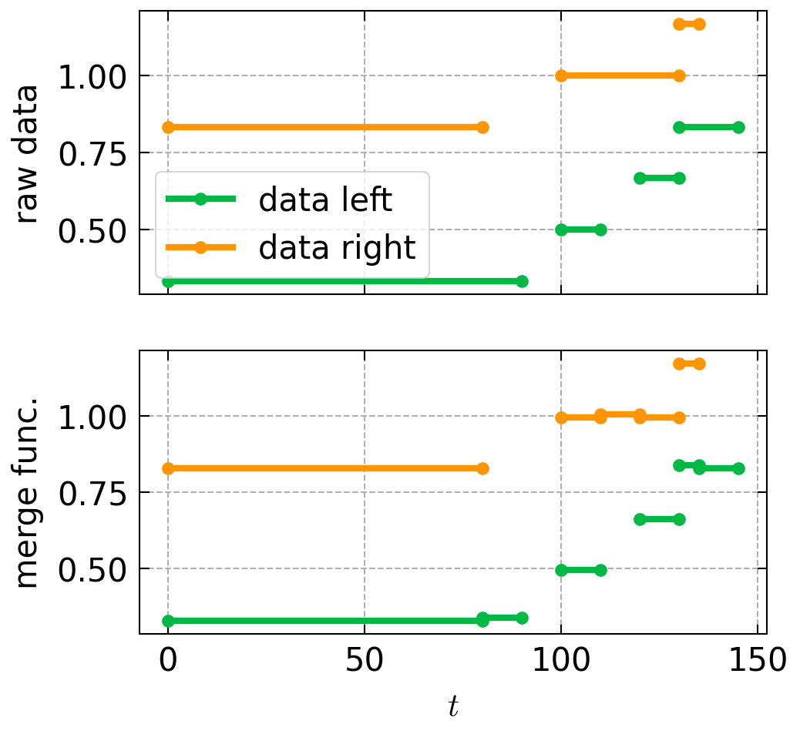

# Tabular data processing for Continuous REPresentation
[](https://docs.pytest.org)

[](https://github.com/eurobios-mews-labs/crep/actions/workflows/publish.yml)
```python
pip install crep
``` 

This simple module aims at providing some function to tackle tabular 
data that have a continuous axis. In situations, this index can represent 
time, but this tool was originally developed to tackle rail way description.

This simple tools helps providing tools to represent a linear structure (cable, rail, beam, pipe) 
whose characteristics are piece-wize constant (of strongly heterogeneous length)

## Basic usage

* **Merge function** merge together two dataframe
```python
import pandas as pd

from crep import merge


df_left = pd.DataFrame(
    dict(id=[2, 2, 2],
         t1=[0, 100, 120],
         t2=[100, 120, 130],
         data1=[0.2, 0.1, 0.5])
)
df_right = pd.DataFrame(
    dict(id=[2, 2, 2],
         t1=[0, 80, 100],
         t2=[70, 100, 140],
         data2=[0.1, 0.3, 0.2])
)

ret = merge(data_left=df_left,
            data_right=df_right,
            id_continuous=["t1", "t2"],
            id_discrete=["id"],
            how="outer")
```
Yield the following result




## Tools

Test if your data is admissible to the merge function, you can use the tools module

```python
import pandas as pd

from crep import tools


df_admissible = pd.DataFrame(
    dict(id=[2, 2, 2],
         t1=[0, 100, 120],
         t2=[100, 120, 130],
         data1=[0.2, 0.1, 0.5])
)
df_not_admissible = pd.DataFrame(
    dict(id=[2, 2, 2],
         t1=[0, 90, 120],
         t2=[100, 120, 130],
         data1=[0.2, 0.1, 0.5])
)
# the second table is not admissible because for t in [90,100] two values are possible

assert tools.admissible_dataframe(
    df_admissible, id_continuous=["t1", "t2"],
    id_discrete=["id"])
assert not tools.admissible_dataframe(
    df_not_admissible, id_continuous=["t1", "t2"],
    id_discrete=["id"])
print(tools.sample_non_admissible_data(
    df_not_admissible, id_continuous=["t1", "t2"],
    id_discrete=["id"]
))
# id  t1   t2  data1
# 1   2  90  120    0.1
```
 

## Acknowledgement
This implementation come from an SNCF DTIPG project and is
developed and maintained by Mews Labs and SNCF DTIPG.


